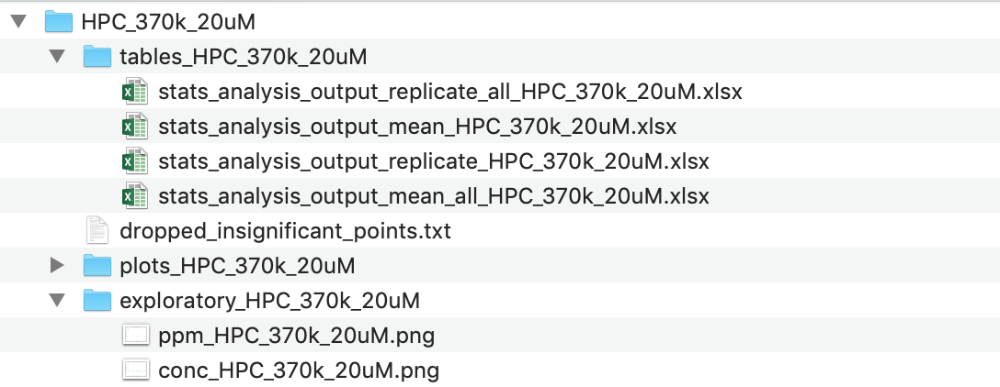
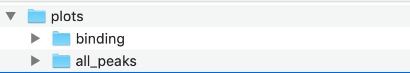

# disco-data-processing
This repository contains the code by the Frank Gu Lab for DISCO-NMR data processing. 

<a></a>

This code transforms integral tables describing individual DISCO-NMR runs into
proton-level summaries of interactive behaivour.
 
To build intuition for the steps underlying DISCO Data Processing in this repository, [we provide a teaching tutorial Colab notebook, linked here.](https://drive.google.com/file/d/1wESRp60sst9mNYsffK9DtpeZ5yPB-ff7/view?usp=sharing).

## Script Mode Data Processing vs Graphical User Interface
We also have a graphical user interface version of the repository to simplify use, [available at this link](https://frank-gu-lab-disco-deployment-test-srcmatd-kuxo11.streamlitapp.com/).

However, if you prefer to run the code locally to scale analysis beyond 7 inputs, and additionally ouput all interim data tables, the present repository provides a comprehensive "script mode" implementation. 

Additionally, data table outputs from running this repository in script mode are directly compatible with the Disco Figures publication plotting template. If you are working on publishing DISCO-NMR results and wish to use the template, conducting your data processing in this repository enables compatibility.

Both the GUI and the present repository are built from identical underlying data processing scripts.

------
## Project Organization
    ├── LICENSE
    ├── README.md      <- The top-level README for this project.
    ├── data
    │   ├── input      <- Place Excel books of integral table data here
    │   └── output     <- The code will auto-generate output folders for each input
    │
    ├── docs/source/src_modules  <- Sphinx documentation files
    ├── src  <- source code
    │   ├── discoprocess <- contains helper functions for data processing
    │   ├── disco-data-processing.py <- Key global data processing executable
    │   ├── standard-figures.py <- Auto-generate buildup curve and fingerprint plots
    │   ├── custom-figures.py   <- Auto-genreated figure customization scripts
    │   ├── dashboard.py        <- Obsolete, preliminary dashboard code
    │   ├── requirements.txt  <- Pip version of requirements for the analysis environment
    │   └── environment.yml   <- Conda version of requirements for the analysis environment
    ├── tests  <- Unit test implementation in Pytest 
    └── docs/source/src_modules  <- Sphinx documentation files
       
--------
## Running the code locally in script mode
### 1. Clone or download this GitHub repository:
Do one of the following:

* Clone this repository to a directory of your choice on your computer using the command line or GitHub Desktop.

* Download the ZIP file of archive of the repository, move and extract it in the directory of your choice on your computer.

### 2. Install dependencies using Anaconda or Pip
### Instructions for installing dependencies via Anaconda:
1. Download and install [Anaconda](https://conda.io/docs/index.html)

1. Navigate to the project directory

1. Open Anaconda prompt in this directory (or Terminal)

1. Run the following commend from Anaconda prompt (or Terminal) to automatically create an environment from the requirements.txt file: `$ conda create --name infrno --file requirements.txt`

1. Run the following command to activate the environment: `conda activate infrno` 

1. You are now ready to open and run files in the repository in a code editor of your choice that runs your virtual environment [(ex: VSCode)](https://code.visualstudio.com/download)

For detailed information about creating, managing, and working with Conda environments, please see the [corresponding help page](https://conda.io/docs/user-guide/tasks/manage-environments.html). 

### Instructions for installing dependencies with pip

If you prefer to manage your packages using pip, navigate in Terminal to the project directory and run the command below to install the preqrequisite packages into your virtual environment:

```
$ pip install -r requirements.txt
```

With either install option, you may need to create an additional Jupyter Notebook kernel containing your virtual environment, if it does not automatically appear. [See this guide for more information.](https://towardsdatascience.com/get-your-conda-environment-to-show-in-jupyter-notebooks-the-easy-way-17010b76e874)

--------
## Running the data processing code
1. Place Excel books of integral tables in the `data/input` folder (Example HPC 370kDa in folder to Quickstart first run of code)
1. Navigate in Terminal to `src` directory
1. Type command `python disco-data-processing.py` to execute script
1. Outputs will be generated automatically in `data/output`. If it is your first time running the script, the output directory will be automatically generated.

## Expected Output

### Per Book Outputs


* output from `disco-data-processing.py` executable


### Merged Datasets: Proton Binding, Quality Check


* output from `disco-data-processing.py` executable

### Standard Figures


* output from `standard-figures.py` executable

## Unit Tests

Currently, 100% of unit tests pass (on Windows machine).

To run unit tests, navigate to the `tests` directory, and run the command `pytest` in Terminal.

## Excel Input Data Formatting Requirements
Please format one experiment, and all its technical replicates, as one Excel Book.

Within a book, each tab corresponds to the integral tables of a technical replicate. The exemplary book for HPC 370kDa is provided in the input folder as a template for format requirements. 

## To Do: Add Guidance on MestreNova Pre-processing and Input Book Formatting